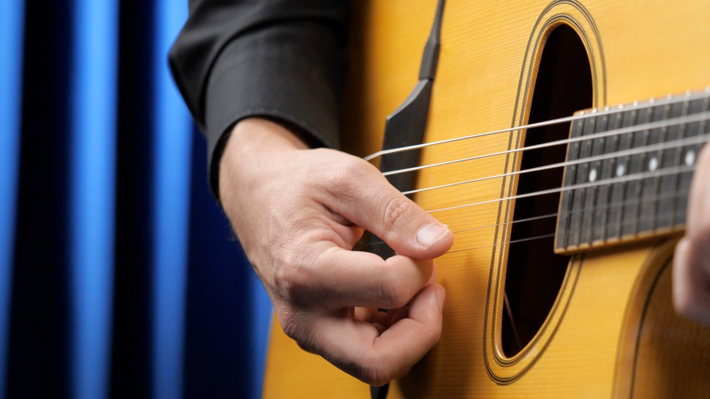
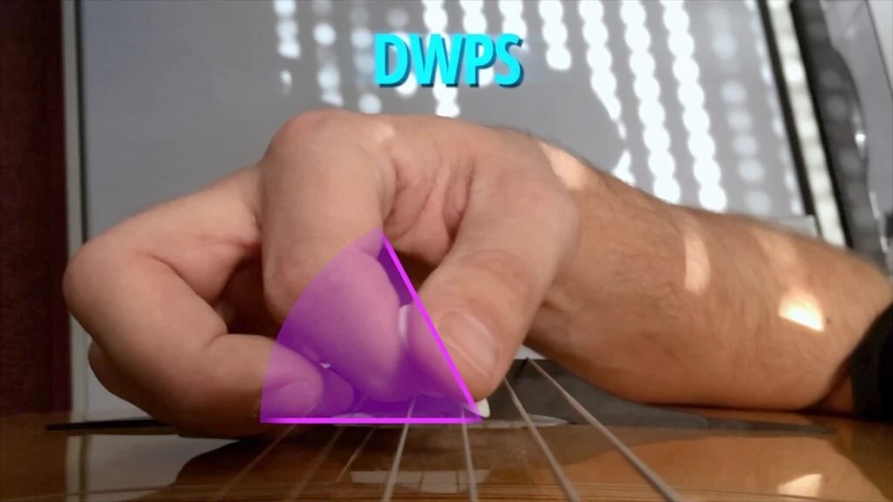
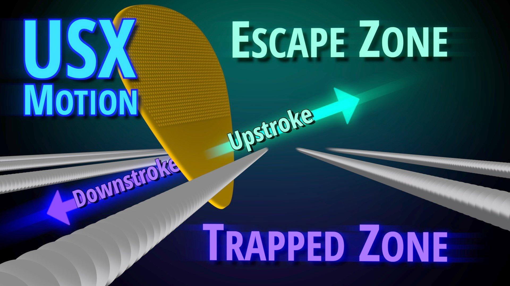

Le basi che nessuno vede
========================

La chitarra (il setup)
----------------------

Prima di parlare di esercizi, facciamo una cosa poco romantica ma
decisiva: mettiamo la chitarra nelle condizioni giuste per farti
imparare davvero.

Perché una chitarra che “risponde male” ti costringe a compensare… e
quando compensi, non stai studiando musica: stai negoziando con lo
strumento.

L'obiettivo di questo materiale è costruire **precisione, controllo,
suono e timing**.

Il setup può aiutarti… oppure sabotarti.

La chitarra deve suonare chiara, ovunque

La regola base è questa: **ogni nota deve uscire piena e pulita** su
tutta la tastiera.

Se hai:

- buzz casuali
- note che muoiono subito
- tasti che “friggono” in certi punti
- un manico troppo curvo o troppo dritto

allora il tuo cervello non capisce più cosa sta succedendo: non sai se
l'errore è tuo o dello strumento.

Quindi, se puoi, fai controllare:

- regolazione del manico
- action e intonazione
- eventuali tasti irregolari

Non serve una chitarra *costosa*. Serve una chitarra **affidabile**.

Tecnica di base… tracolla e postura
------------------------------------

Qui stiamo parlando di tecnica nel senso più concreto possibile: non
“velocità”, non “trucchi”, ma come metti il corpo e le mani nelle
condizioni di funzionare bene. Puoi fare ore e ore di esercizi, ma se la
posizione di base lavora contro di te, stai remando con un freno tirato.

L'obiettivo è semplice: **togliere attrito inutile**, così quello che
studi resta… e si trasferisce davvero nel suonare.

**Indossa sempre la tracolla anche da seduto**. Non è una questione di
stile… è una questione di libertà.

- Le mani non devono “tenere su” la chitarra… quello è il lavoro della
  tracolla.
- Regola la tracolla in modo che l'altezza e la posizione dello
  strumento siano le stesse da seduto e in piedi.
- La coerenza conta: se studi seduto con la chitarra alta e poi suoni in
  piedi con la chitarra bassa, gran parte di ciò che hai “programmato”
  nel corpo cambia all'improvviso.

In pratica… fai in modo che il tuo corpo impari sempre lo stesso gesto,
nello stesso assetto.

La **postura non è un dettaglio estetico**. Influenza coordinazione,
respiro, rilassamento e precisione.

   schiena più dritta = corpo più efficiente.

Evita queste abitudini:

- non “collassare” in avanti con le spalle
- non appoggiare la chitarra completamente piatta sulla coscia (un
  leggero angolo va bene)
- non scaricare il peso dell'avambraccio sinistro sulla coscia sinistra
  (se diventa abitudine, blocca movimenti e libertà)
- non spingere il manico troppo in avanti, come se dovessi “raggiungere”
  le note

Fai invece così:

- siediti **dritto e leggermente in avanti**
- alza il manico quel tanto che basta per sentirti comodo… idealmente la
  tastiera “sale” verso di te, non scappa lontano
- prova a studiare sempre su una sedia simile: a volte progressi
  incostanti dipendono semplicemente da un assetto incostante
- rilassa il corpo intero (anche le braccia)… respira… e poi metti a
  fuoco

Questa sezione sembra “banale” finché non la applichi. Ma quando la
applichi succede una cosa concreta: suoni con meno sforzo, e quello che
studi diventa più stabile, più ripetibile… più tuo.

Corde: resistenza e ritorno
---------------------------

La velocità non si allena correndo. Si allena costruendo una pennata
prevedibile e una mano sinistra stabile.

Per questo la corda deve offrirti **resistenza** e soprattutto un buon
**ritorno**: deve tornare al suo centro in modo consistente dopo
l'attacco.

Corde troppo leggere spesso:

- si muovono in modo “molle”
- rendono la pennata meno prevedibile
- invitano a schiacciare e stringere troppo (per compensare)

Per lo studio, una muta medio-corposa è spesso ideale (indicativamente:
non scendere sotto una prima corda tipo **.012** per chitarre archtop o
semiacustiche).

Non è un dogma… è un punto di partenza intelligente se vuoi mani più
solide e un suono più fermo.

.. hint::
	Se cambi scalatura e senti fastidio o tensioni strane, ridimensiona subito.
	Qui stiamo costruendo controllo… non stiamo facendo prove di forza.

Un'action medio-alta (senza esagerare) aiuta perché:

- riduce i buzz
- rende più educativa la mano sinistra (pressione e rilassamento reali)
- costringe la mano destra a essere più accurata

Nel tempo, se vuoi, puoi tornare a un'action più bassa... ma partire “troppo facile” spesso impigrisce.

Nella vita reale molti suonano con:

- corde leggere
- action bassa
- chitarre molto “veloci”

per esigenze di stile, comfort, live, repertorio. È normale.

Se però puoi permettertelo, un'idea furba è avere:

- una chitarra “da suonare”
- una chitarra “da studiare”

Non è obbligatorio, ma è un modo semplice per non dover cambiare setup ogni settimana.

Se lo strumento è regolato bene, ogni esercizio diventa più onesto: senti subito se il problema è nel suono, nel tempo o nel gesto.

E quando lo studio è onesto... i progressi non sono un'opinione: si sentono.

Il tempo prima delle note
-------------------------

Se vuoi una verità semplice ma scomoda: la musica non è fatta di note. Le note sono il materiale. La musica è **come scorrono nel tempo**.

Puoi suonare le note giuste e non suonare musica. Puoi suonare due note soltanto e far succedere qualcosa di enorme, se il tempo è vivo.

Per questo il lavoro più importante, soprattutto all'inizio, non è “quale scala”, “quale accordo”, “quale diteggiatura”. È mettere a posto la cosa che regge tutto: la **pulsazione**.

Pulsazione, non griglia
~~~~~~~~~~~~~~~~~~~~~~~

Molti studiano il tempo come se fosse un foglio quadrettato: una griglia che devi riempire correttamente. È comprensibile... ma è un'immagine che ti porta fuori strada.

La pulsazione non è un reticolo. È più vicina a:

- una camminata
- un respiro
- un dondolio
- un peso che passa da un piede all'altro

Quando il tempo è griglia, suoni “corretto”. Quando il tempo è pulsazione, suoni “vivo”. La differenza si sente subito:

- nella griglia, conti
- nella pulsazione, ti muovi

E non è una cosa poetica. È fisica: se la pulsazione è nel corpo, le mani smettono di inseguire. Se la pulsazione non c'è, le mani corrono, frenano, si irrigidiscono, anticipano, ritardano a caso.

Un modo semplice per capire se stai vivendo la pulsazione:

- riesci a battere il piede o ondeggiare senza disturbare il fraseggio?
- la frase “cade” sul tempo o la rincorre?

Se rincorre, non è un problema di note. È un problema di tempo.

Metronomo: amico scomodo, non tiranno
~~~~~~~~~~~~~~~~~~~~~~~~~~~~~~~~~~~~~

Il metronomo è una presenza difficile. Lo odiano in tanti perché mette in luce una cosa che non vogliamo vedere: il tempo non è stabile come pensiamo.

Ma il metronomo non deve diventare il capo. Deve diventare uno specchio.

Il modo **sbagliato** di usarlo è:

- fissarsi sui bpm come fossero livelli di un videogioco
- aumentare sempre
- sentirsi “fallito” se si deraglia

Il modo utile è:

- usarlo lento
- usarlo come riferimento esterno
- imparare a stare **intorno** al click, non “sopra” il click

Qui la parola chiave è: **comfort**.

Se un esercizio a 60 bpm ti fa irrigidire, è troppo veloce. Se a 40 bpm ti annoia, è perfetto: perché lì puoi ascoltare.

Cose intelligenti da fare col metronomo:

- suonare pochissimo (anche una sola nota) ma perfettamente dentro
- curare attacco e durata, non solo l'istante in cui “parti”
- tenere il click come “batterista minimale”, non come poliziotto

E soprattutto: il metronomo non serve a dimostrare che sei preciso. Serve a costruire una sensazione interna che poi resta anche quando lui sparisce.

Un segno che lo stai usando bene è quando, dopo averlo spento, continui a sentire il tempo in modo chiaro.

Dove cade davvero il “due” e perché cambia tutto
~~~~~~~~~~~~~~~~~~~~~~~~~~~~~~~~~~~~~~~~~~~~~~~~

Questa è una delle cose più semplici da dire e più difficili da fare: molti non perdono il tempo sull'“uno”. Lo perdono sul “due”.

Perché? Perché l'“uno” è un faro: è l'inizio, è evidente, è l'appoggio naturale. Il “due” invece è il posto in cui si capisce se stai camminando davvero o se stai solo saltellando.

Pensa a una camminata:

- un piede è l'uno
- l'altro piede è il due

Se uno dei due piedi arriva incerto, tutto il passo diventa instabile.

Nella musica moderna (blues, rock, funk, jazz, pop) il “due” e il “quattro” sono spesso i battiti dove senti lo snare (il rullante) della batteria. È lì che si crea il senso di “groove”. Non devi conoscere la batteria per capirlo: basta ascoltare.

Quando il “due” è debole o spostato male, succede questo:

- la frase sembra inciampare
- acceleri senza accorgertene
- l'accento finisce in posti strani
- perdi il backbeat, quindi perdi il linguaggio

E qui arriva la cosa potente: se metti a posto il “due”, metti a posto mezzo mondo.

Un esercizio semplice
^^^^^^^^^^^^^^^^^^^^^

Metti il metronomo lento e fai solo questo:

- conta “1 2 3 4” a voce (puoi anche farlo in inglese se preferisci, “one two three four”)
- batti il piede su tutti i battiti
- poi batti le mani (o schiocca le dita) solo su “2” e “4”

Non devi essere bravo. Devi essere stabile.

Ora prendi la chitarra. Quando senti che il “due” è solido, prova a suonare una nota sola su “2”. Poi due note. Poi una frase (se ci riesci). Ma sempre con quel “due” ben piantato.

Il motivo per cui cambia tutto è che il “due” è un punto di verità: ti obbliga a distribuire il tempo, non a puntare solo sul faro dell'“uno”.

Il backbeat: la spina dorsale del groove
~~~~~~~~~~~~~~~~~~~~~~~~~~~~~~~~~~~~~~~~

Se c'è una cosa che separa “sto contando” da “sto suonando”, spesso è questa: **il backbeat**.

Il backbeat è l'accento su **2 e 4** dentro una misura in 4/4.

È la sensazione di battere le mani sul “due” e sul “quattro”, come fanno i cori, come fa il pubblico ai concerti, come fa la batteria con lo snare in buona parte della musica moderna.

Non è una regola... è un linguaggio.

Perché è così importante? Perché il backbeat crea:

- gravità ritmica: senti dove “cade” la musica
- spinta: la frase sembra camminare in avanti
- stile: blues, rock, funk, pop, soul... parlano spesso questa grammatica

Quando il backbeat è presente, anche un fraseggio semplice sembra “giusto”.

Quando manca (o è debole), puoi suonare mille note e sembrare fuori posto, anche se sei a tempo.

Il backbeat non è solo “accentare”. Qui c'è il punto: non è solo mettere più volume su 2 e 4. È sentire che 2 e 4 sono **il posto dove il corpo si appoggia**.

Se lo vivi bene, succedono due cose:

- smetti di correre sull'*uno*
- inizi a distribuire il tempo con equilibrio

È come camminare: non è importante solo il passo che parte, ma l'alternanza dei passi.

Un esercizio ridicolo ma potentissimo
^^^^^^^^^^^^^^^^^^^^^^^^^^^^^^^^^^^^^

Metronomo lento. Non suoni niente.

1. Conta a voce: **1 2 3 4**
2. Batti le mani solo su **2 e 4**
3. Ora suona una sola nota su **2 e 4** (qualsiasi nota, non importa)
4. Poi suona una nota su ogni battito... ma continua a “sentire” il backbeat come se le mani battessero ancora su 2 e 4

Se quando inizi a suonare il backbeat sparisce, non è un fallimento: è l'esercizio che sta funzionando. Significa che hai trovato la cosa da allenare.

Sulla chitarra il backbeat vive spesso in tre posti:

- nella mano destra (come attacco e accento)
- nel muting (le ghost notes fanno da “snare” invisibile)
- nel comping (accordi corti su 2 e 4, o risposte che rispettano quel peso)

Un comping semplice con accenti sul backbeat può far suonare “musicale” anche un giro banale. Senza backbeat, lo stesso giro può sembrare un esercizio scolastico.

Una frase da tenere a mente:

.. important::
  Il tempo ti dice dove sei. Il backbeat ti dice come cammini.

Se metti in piedi il backbeat, metà del groove è già lì... e tutto il resto, note comprese, smette di essere una lotta.

Vediamo un modo pratico per imparare a fare del backbeat il nostro gesto quotidiano. 
Il **count-in** è il “conteggio di partenza”: quei numeri (detti a voce o suonati) che servono a far entrare tutti **insieme**, allo **stesso tempo** e con lo **stesso feel**, prima che inizi davvero il brano.

Dillo così:

**“a ONE... a TWO... a one TWO three FOUR”**

Cioè:

- il primo “a one” e “a two” sono solo per mettere il bpm
- poi fai sentire che **2 e 4 hanno un peso diverso**
- poi parti sul successivo 1

Non devi gridare. Basta cambiare micro-intenzione: “due” e “quattro” sono più “pesanti”.

Dinamica: suonare piano è difficile
-----------------------------------

C'è una cosa che quasi nessuno ti dice subito: **suonare forte è facile, suonare piano no**.

Suonare piano richiede **controllo, ascolto, precisione**. È come scrivere con una matita ben temperata invece che con un pennarello. Con il pennarello “esce” tutto comunque. Con la matita... ogni dettaglio conta.

La dinamica non è solo volume. È **intenzione**. È decidere quanto spazio occupa ogni nota nella stanza.

Volume come intenzione
~~~~~~~~~~~~~~~~~~~~~~

Molti alzano il volume per “sentirsi” e perché la chitarra, soprattutto elettrica, a basso volume sembra meno soddisfacente. Ma il volume non è una garanzia di musicalità: è solo energia grezza.

Quando inizi a trattare il volume come intenzione, succede questo:

- una nota può essere piccola ma importantissima
- una frase può essere morbida ma chiarissima
- un accento può dire più di dieci note veloci

Nel mondo reale, la dinamica è anche un atto di rispetto: se suoni con altri, la tua dinamica decide se stai accompagnando o stai coprendo.

E c'è un paradosso bellissimo: spesso, chi suona piano con controllo, viene percepito come più autorevole. Perché l'orecchio è costretto ad avvicinarsi.

Accenti, ghost notes, controllo
~~~~~~~~~~~~~~~~~~~~~~~~~~~~~~~

La dinamica vive nei contrasti. Non nel “suonare tutto forte” o “tutto piano”, ma nel dare forma al tempo con:

- accenti
- note fantasma (*ghost notes*)
- durata

Un *accento* non è solo una nota più forte. È una nota che, per un istante, diventa il centro dell'attenzione.

E può essere ottenuto in più modi:

- più volume
- attacco più netto
- nota leggermente più lunga
- timbro più brillante

La cosa importante è che l'accenti

- note fantasma (ghost notes)
- durata

l'accento deve essere intenzionale. 
Se gli accenti capitano a caso, stai solo “inciampando”.

Le ghost notes sono note quasi mute, percussive, che non hanno lo scopo di essere “sentite” come altezza, ma come ritmo. Sono il collante tra un evento e l'altro.

Sulla chitarra spesso sono:

- corde stoppate dalla mano sinistra
- pennate leggere e secche
- piccoli colpi che riempiono senza invadere

Le ghost notes sono un segreto del groove perché permettono di:

- mantenere la mano destra in movimento
- creare pulsazione interna
- dare l'illusione di una batteria dentro la chitarra

Il controllo è la capacità di scegliere: questa nota sì, questa no. 
Questa forte, questa appena sussurrata. 
Questa lunga, questa corta. 
E la scelta principale è sempre una: **non suonare tutto uguale**.

Stessa frase... tre intensità diverse
~~~~~~~~~~~~~~~~~~~~~~~~~~~~~~~~~~~~~

Uno dei modi più rapidi per diventare musicali è prendere una frase semplicissima e farla vivere in tre versioni.

Prendi una frase di 4 note. Anche banale. E suonala così:

#. **Sussurrata**
   
   Tutto piano, attacco morbido, note corte. Obiettivo: restare chiaro senza alzare la voce.

#. **Neutra**
   
   Volume medio, tutto leggibile, accenti minimi. Obiettivo: stabilità.

#. **Dichiarata**

   Un accento preciso su un punto (spesso 2 o 4, o sul punto “forte” della frase). Obiettivo: far capire all'ascoltatore cosa vuoi dire.

Questo esercizio sembra facile... ma ti costringe a scoprire che la musica non è “le note che suoni”. È come le pronunci.

Suono: la mano destra come fonico
~~~~~~~~~~~~~~~~~~~~~~~~~~~~~~~~~

Se la mano sinistra decide quali note suonare, la mano destra decide **chi sei**. Perché la mano destra governa la cosa più importante: il suono nel tempo.

Pensala così: la mano destra è il tuo fonico personale. E un fonico bravo non cambia le note... cambia l'impatto.

Ogni nota ha tre momenti, e ognuno di questi è musica:

#. **Attacco**

   Come parte la nota. Secco? Morbido? Aggressivo? Carezzato? L'attacco spesso comunica più della nota stessa.

#. **Durata**

   Quanto rimane. Una nota lunga dice “fermati qui”. Una nota corta dice “vai avanti”.

#. **Rilascio**

   Come finisce. Pulito? Tagliato? Soffocato? Lasciato evaporare? Il rilascio è spesso la differenza tra “suonare” e “parlare”.

Molti chitarristi lavorano sull'attacco e ignorano il rilascio. Ma il rilascio è dove vive il groove: il ritmo non è solo quando suoni... è anche quando smetti.

Dove pizzichi cambia la frase più delle note
~~~~~~~~~~~~~~~~~~~~~~~~~~~~~~~~~~~~~~~~~~~~

Sulla chitarra, cambiare punto di pizzico cambia il timbro in modo drastico:

- vicino al ponte: suono più brillante, più duro, più “pronunciato”
- verso il manico: suono più rotondo, più morbido, più vocale

La cosa sorprendente è che questo può cambiare la percezione di una frase più di una singola nota diversa. Perché modifica l'intenzione emotiva.

È come dire la stessa frase con un tono diverso:

- ironico
- serio
- sussurrato
- dichiarato

Stessa frase, significato diverso.

Un esercizio semplice: prendi una frase e suonala identica, ma una volta vicino al ponte e una volta verso il manico. Ascolta come cambia il carattere. È teoria del suono, ma fatta con le mani.

Pulizia: muting come parte del groove
~~~~~~~~~~~~~~~~~~~~~~~~~~~~~~~~~~~~~

La pulizia non è “non fare rumore”. **La pulizia è decidere quali rumori fanno parte della musica e quali no**.

Il *muting* (stoppare le corde) non è solo un sistema per evitare pasticci. È uno strumento ritmico. Due tipi fondamentali:

- muting della mano sinistra: spegni le corde non suonate, controlli risonanze, crei ghost notes
- muting della mano destra: *palm muting*, controllo della durata, attacco più percussivo

Quando il muting è fatto bene:

- il groove diventa più chiaro
- gli accenti diventano più netti
- la frase sembra “montata” meglio, come un film con tagli puliti

E soprattutto: il silenzio diventa parte del suono. Non un vuoto... ma un evento.

Respirare sullo strumento
-------------------------

Uno dei motivi per cui tanta gente “suona giusto” ma non comunica è che non respira. Non fisicamente... musicalmente. Le frasi partono, si affollano, si incastrano, e l'orecchio non trova mai un punto dove appoggiarsi.

Respirare sullo strumento significa una cosa semplice: **dare alla musica il diritto di finire una frase prima di iniziarne un'altra. È far sentire che stai parlando, non che stai digitando**.

E la cosa bella è che non serve suonare di più. **Spesso serve suonare di meno**.

Frasi corte, frasi lunghe
~~~~~~~~~~~~~~~~~~~~~~~~~

Una frase corta è una frase che dice una cosa sola e la dice bene. È come una battuta in una conversazione: chiara, netta, con un punto.

Le frasi corte servono perché:

- ti costringono a scegliere
- ti obbligano a mettere intenzione in poche note
- rendono il ritmo evidente
- lasciano spazio a risposta e sviluppo

E soprattutto... ti insegnano a non “riempire per ansia”.

Una frase lunga, invece, è una frase che attraversa il tempo senza perdere il filo. Non è “tante note”. È continuità: un'idea che si estende, cambia leggermente, si trasforma, ma resta riconoscibile.

Le frasi lunghe servono perché:

- allenano la tenuta del tempo
- allenano la direzione (dove sto andando?)
- evitano il fraseggio a “pezzetti” che sembra una lista

Il punto non è scegliere una volta per tutte. Il punto è avere entrambe le cose nel corpo, e alternarle come fanno i parlanti bravi:

- frasi corte per essere chiari
- frasi lunghe per raccontare

Un segnale che sei sulla strada giusta: quando riesci a suonare una frase lunga senza accelerare e senza “scappare” dai punti vuoti.

Silenzio attivo
~~~~~~~~~~~~~~~

Il silenzio non è un buco tra le note.

Il silenzio è una nota che non hai suonato... ma che l'orecchio sente lo stesso.

Silenzio attivo significa che quando non suoni:

- il tempo continua
- l'intenzione continua
- la frase continua nella testa

Non stai “aspettando”. Stai tenendo la tensione.

Ci sono due tipi di silenzio che vale la pena riconoscere:

#. Silenzio di punteggiatura

   Serve a chiudere, respirare, far capire che una frase è finita. È il punto, la virgola, i due punti.

#. Silenzio di attesa

   Serve a creare domanda. È il “non detto” che rende interessante la frase successiva. Non è rilassamento... è sospensione.

Molti silenzi sono passivi: molli il tempo, perdi l'idea, e quando rientri rientri a caso.

Il silenzio attivo invece è pieno: rientri con precisione perché stavi contando con il corpo, non con la mente.

.. admonition:: Test semplice

   Riesci a rientrare dopo un silenzio esattamente sul punto giusto senza guardare nessuno e senza andare a tentativi? Se sì, il silenzio è attivo.

Il respiro come metronomo interno
~~~~~~~~~~~~~~~~~~~~~~~~~~~~~~~~~

Qui entriamo in una cosa molto concreta e molto sottovalutata: il respiro è un metronomo naturale. 
Non perché sia perfettamente regolare come una macchina, ma perché ti dà frasi.

Il metronomo esterno (click) ti dà battiti.

Il respiro ti dà periodi musicali.

E infatti tanti musicisti che “hanno tempo” non sembrano contare... sembrano respirare dentro la musica.

Come usare questa cosa?

- Inspira su una parte della frase, espira su un'altra.
- Fai in modo che la frase abbia un inizio e una fine, come una frase parlata.
- Se ti accorgi che trattieni il respiro quando suoni un passaggio difficile, quello è un campanello: stai entrando in modalità “controllo rigido”. Rilassa, rallenta, e respira.

Una delle cose più potenti che puoi fare è allenare frasi che durano esattamente quanto un respiro comodo. Non un'apnea, non un fiatone... un respiro naturale.

Perché? Perché ti costringe a:

- distribuire le note nel tempo
- dare direzione
- non accelerare
- non riempire tutto

E se suoni con altri, il respiro ti collega a loro meglio di qualsiasi teoria: tutti respirano, anche se non se ne accorgono.

Un piccolo esercizio: Scegli una frase corta (2 battute). Suonala. Poi fai 1 battuta di silenzio attivo. Poi suonala di nuovo.

Poi prova:
- frase lunga (4 battute)
- 2 battute di silenzio attivo
- rientro perfetto

Non ti interessa quante note. Ti interessa:

- che la frase abbia forma
- che il silenzio tenga il tempo
- che il rientro sia inevitabile

Se riesci a fare questo, la tua musica cambia in un pomeriggio.

.. admonition:: Una frase da tenere sul leggio
  
   Se non respiri, la frase non vive.
   Se non lasci silenzio, l'orecchio non capisce.
   E quando il respiro diventa tempo... smetti di contare e inizi a parlare.

Mano sinistra: stabilità senza forza
------------------------------------

La mano sinistra è piena di malintesi. Il più comune è questo: “se non suona bene, devo premere di più”. Quasi sempre è falso. Premere di più raramente risolve... spesso complica: irrigidisce, rallenta, sporca, stanca.

L'obiettivo reale è un altro: **stabilità senza forza**.

Stabilità significa che la nota esce chiara quando vuoi tu. Senza tremare. Senza rumori inutili. Senza che la mano diventi una morsa.

E c'è una buona notizia: la stabilità non nasce dalla potenza. Nasce da micro scelte.

Pressione minima utile
~~~~~~~~~~~~~~~~~~~~~~

La pressione minima utile è la quantità di forza necessaria perché la nota suoni pulita... e non un grammo di più.

Tutto il resto è spreco. E lo spreco, sulla chitarra, si paga in:

- stanchezza
- rigidità
- imprecisione
- rumori
- vibrato e bending più difficili
- intonazione che sale (soprattutto sugli strumenti con action bassa o corde sottili)

Un modo pratico per trovarla:

- metti un dito su una nota e premi appena appena
- pizzica: magari la nota frigge o non suona
- aumenta la pressione di poco finché la nota diventa pulita
- fermati lì

Quello è il tuo “minimo utile” per quella nota, su quel tasto, su quella corda, con quella pressione della mano destra.

La cosa importante è che non è una cifra fissa per sempre. Cambia con:

- il setup dello strumento
- la corda
- la posizione
- il tipo di attacco
- la dinamica

Ma il principio resta: non cercare la sicurezza nella forza. Cercala nella precisione.

Un indizio che stai premendo troppo: quando lasci la nota e il dito “si stacca” come se fosse incollato, oppure senti tensione nell'avambraccio dopo pochi minuti.

Micro movimenti, macro risultati
~~~~~~~~~~~~~~~~~~~~~~~~~~~~~~~~

La chitarra sembra grande, ma si suona con movimenti piccoli. Quando un passaggio non riesce, spesso non è perché “non hai tecnica”... è perché stai usando movimenti troppo grandi per una cosa che richiede finezza.
Tre micro movimenti che cambiano tutto:

- **Avvicinarsi al tasto giusto**

  La nota suona più facilmente se il dito è vicino al tasto (non sopra il tasto metallico, ma appena dietro). Più sei vicino, meno pressione serve.

- **Curvatura e appoggio**

  Non serve un dito “perfettamente verticale”. Serve un appoggio stabile.

  Un dito leggermente inclinato, se controllato, può essere più stabile di un dito rigido e verticale.

- **Rilasciare invece di sollevare**

  Molti sollevano le dita “in aria” a ogni cambio, come se dovessero ripartire da zero. Questo crea:
  
  - rumore
  - lentezza
  - tensione

  La mano sinistra efficiente fa una cosa diversa: rilascia.

  Riduce la pressione, resta vicina alla corda, e si sposta di pochi millimetri.

  È come camminare: non salti a ogni passo, appoggi e trasferisci peso.

.. hint::

  La velocità non si costruisce accelerando... si costruisce accorciando il movimento.

Cambiare corda
~~~~~~~~~~~~~~

Il rumore nel cambio corda non è “colpa tua”. È naturale: la chitarra è un oggetto risonante con corde libere che vogliono vibrare. Il punto non è eliminarlo al 100%... è governarlo, come un fonico.

Ci sono due tipi di rumore tipici:

- corde che suonano senza essere invitate
- scivolate e “strisciate” della mano sinistra

Il principio base: una corda non suonata deve essere in uno di questi due stati:

- mutata (stoppata)
- protetta (cioè fisicamente “coperta” da qualcosa)

La mano sinistra può fare moltissimo, spesso più di quanto si pensi.

Muting con la mano sinistra (semplice e potentissimo):

- Quando suoni una corda, le dita libere possono appoggiarsi leggermente alle corde adiacenti.
- Anche il dito che sta suonando può, con una micro inclinazione, toccare appena la corda sopra o sotto per impedirle di partire.

Non è forza. È contatto.

Effettua cambi di corda “silenziosi” con rilascio controllato. Invece di staccare di colpo un dito e far “schioccare” la corda:

- riduci pressione
- lascia il dito in contatto leggerissimo mentre cambi
- poi spostati

Il contatto leggero spegne la corda come un freno dolce.

Attenzione ai passaggi in posizione
~~~~~~~~~~~~~~~~~~~~~~~~~~~~~~~~~~~

Quando scivoli lungo la tastiera, il rumore di scivolata è normale. Ma puoi scegliere:

- scivolata come effetto (musicale)
- scivolata come rumore (inutile)

Differenza? Intenzione e volume. Se suoni piano e controlli il rilascio, la scivolata sparisce. Se premi come una morsa, la scivolata diventa un effetto involontario.

.. hint::

   Se vuoi più pulizia, cerca prima di tutto:

   - meno pressione
   - meno altezza delle dita
   - più contatto intelligente

Non servono “dita più forti”. Servono dita più consapevoli.

E quando senti che la mano sinistra si irrigidisce, è quasi sempre un segnale semplice: stai chiedendo alla forza di fare il lavoro del controllo. Riduci, respira, rallenta... e ritrova la pressione minima utile.

Supportive Fingering
--------------------

Il **supportive singering** è una di quelle cose che, quando la scopri, ti chiedi come hai fatto a non farla prima. Perché non è una “tecnica speciale”... è buon senso applicato alla mano sinistra.

L'idea è semplice: le dita non sono quattro entità separate. Sono un sistema. E un sistema funziona meglio quando le parti si aiutano.

Supportive fingering significa proprio questo: quando un dito sta facendo un lavoro difficile (tenere una nota, piegare una corda, fare vibrato, sostenere un legato), le altre dita possono supportarlo aggiungendo stabilità e togliendo tensione.

Il risultato non è solo “più forza”. È l'opposto: meno fatica, più controllo, più intonazione, più suono.

Dita che si aiutano... e la mano si rilassa
~~~~~~~~~~~~~~~~~~~~~~~~~~~~~~~~~~~~~~~~~~~

Molti suonano come se ogni dito dovesse dimostrare di essere indipendente. È un mito da palestra. Nella musica reale, l'indipendenza totale non è un valore... lo è l'efficacia.

Quando fai Supportive Fingering succede questo:

- il dito principale smette di “lottare”
- la mano si compatta senza irrigidirsi
- il pollice dietro al manico non deve stringere
- l'intonazione diventa più stabile

E soprattutto: le dita “di supporto” non servono a schiacciare. Servono a condividere il carico.

Esempio tipico (senza entrare in diteggiature specifiche): se stai suonando una nota col terzo dito e ti serve stabilità, puoi appoggiare il secondo dietro o accanto al terzo. Non stai barando. Stai suonando bene.

.. hint::
   
   Se una nota richiede energia (bending, vibrato, tenuta lunga), chiedi aiuto alle dita vicine.

Bending, vibrato, note tenute
~~~~~~~~~~~~~~~~~~~~~~~~~~~~~

Qui il Supportive Fingering diventa indispensabile.

Il bending non è un “tiro di dito”. È un movimento della mano, guidato dal dito, con un punto di appoggio stabile.

Se provi a piegare usando solo il dito “che suona”, succedono tre cose:

- perdi intonazione
- ti stanchi subito
- il polso si irrigidisce

Con supportive fingering invece:

- il dito principale guida la corda
- le dita dietro aiutano a spingere
- la mano si muove come un blocco controllato

Risultato: bending più intonati e meno dolorosi.
Piccola osservazione importante: le dita di supporto non devono per forza “premere forte”. Devono essere incollate al gesto, così che il carico non ricada tutto su un tendine.
Il **vibrato**, per essere bello, deve essere:

- regolare
- controllato
- coerente con l'intonazione (non un tremolio nervoso)

Con un dito solo spesso diventa un micro panico. Con supporto, invece, il vibrato nasce da un movimento più stabile della mano e il dito principale può concentrarsi sulla finezza, non sulla sopravvivenza.

Un vibrato con supporto suona spesso:

- più largo ma più controllato
- meno “shaky”
- più cantabile

**Tenere una nota** mentre fai altro è una delle cose che fanno sembrare un chitarrista “solido”. Ma è anche un punto dove la mano si irrigidisce facilmente.

Supportive fingering qui significa:

- non lasciare che il dito che tiene la nota diventi un gancio teso
- usare, quando possibile, una micro “impalcatura” con le dita vicine
- distribuire la tensione su più punti

In pratica: la mano resta presente, ma non schiaccia.

Errori tipici e correzioni
~~~~~~~~~~~~~~~~~~~~~~~~~~

Il supportive fingering è semplice, ma ha trappole comuni.

**Errore 1: “aiuto = schiaccio di più”**

Se le dita di supporto diventano un modo per aumentare pressione, la mano si irrigidisce e perdi il vantaggio.

Correzione: pensa “stabilità”, non “forza”.

Le dita di supporto devono dare appoggio, non stritolare la corda.

**Errore 2: pollice che stringe come una morsa**

È l'errore classico: per compensare un bending o una nota tenuta, il pollice dietro al manico stringe. Risultato: avambraccio duro, mano lenta.

Correzione: lascia che il supporto venga dalle dita e dal movimento della mano, non dalla pinza pollice-indice. Il pollice è un punto di riferimento, non un gancio.

**Errore 3: dita di supporto “volanti”**

Se le dita che potrebbero aiutare stanno in aria, è come cercare di spingere un mobile con un dito solo.

Correzione: tienile vicine, pronte. Non devono essere tese, devono essere disponibili.

**Errore 4: perdere intonazione nei bending**

Senza supporto, l'intonazione va e viene. Con troppo supporto e troppa forza, l'intonazione sale troppo.

Correzione: fai bending lenti, ascolta il punto di arrivo, e usa il supporto per stabilizzare, non per superare il target.

**Errore 5: vibrato nervoso**

Il vibrato “da ansia” succede quando il dito prova a fare tutto.

Correzione: stabilizza con supporto e fai partire il vibrato dal movimento della mano. Piccolo, regolare, controllato.

.. important::

   Il supportive fingering non è un trucco per essere più forti.

È un modo per essere più rilassati... e quindi più precisi.

Quando lo interiorizzi, cambia tutto: bending più intonati, vibrato più cantabile, mano sinistra più morbida, e una sensazione nuova... quella di non combattere contro lo strumento, ma di appoggiarti a lui.

Finger Roll
-----------

Il **finger roll** è una tecnica minuscola, quasi invisibile... ma ti apre porte enormi. È uno di quei gesti che fanno sembrare la chitarra più “fluida”, più legata, più naturale, senza che tu debba correre o fare acrobazie.

L'idea è semplice: suoni due (o più) note su corde adiacenti usando lo stesso dito, ma non come un barré fisso. Le suoni una dopo l'altra, “rotolando” il dito. Da qui il nome: roll.

Il punto non è schiacciare due corde insieme. Il punto è farle parlare in sequenza, con controllo e pulizia.

Una nota dopo l'altra con lo stesso dito
~~~~~~~~~~~~~~~~~~~~~~~~~~~~~~~~~~~~~~~~

Immagina il dito come una piccola ruota che si appoggia prima su una corda e poi sull'altra. Non è un movimento grande. È un micro cambio di pressione e di angolo.

Cosa succede se provi a farlo “di forza”?

- suonano due corde insieme
- si impasta tutto
- perdi la chiarezza delle note
- la mano si irrigidisce

Il roll invece è un gesto elegante:

- premi e suoni la prima nota
- rilasci appena quella corda (senza staccarti dal tasto)
- ruoti micro, e premi la corda adiacente
- suoni la seconda nota

Chiave: rilasciare è più importante che premere.

Un buon roll si riconosce perché:

- le note non si sovrappongono (se non lo vuoi)
- il passaggio è morbido, non “a scatto”
- la mano resta rilassata
- non senti fatica extra

Legato “pulito” senza correre
~~~~~~~~~~~~~~~~~~~~~~~~~~~~~

Il finger roll serve tantissimo per fare legato pulito, perché elimina un problema tipico: il “rimbalzo” della mano sinistra quando cambi corda.
Molti, per cambiare corda, alzano troppo il dito e lo rimettono giù. Questo crea:

- rumore
- imprecisione
- tensione

e spesso una nota che non suona bene

Con il roll, invece, resti “incollato” al tasto e fai un micro spostamento controllato.

.. important::
   
   Il finger roll non è per fare cose veloci. È per fare cose chiare.

Se diventi pulito da lento, la velocità arriva dopo come conseguenza.

Due obiettivi realistici del finger roll:

- rendere legati e arpeggi più cantabili
- ridurre i rumori tra le corde
- evitare doppi suoni indesiderati

Un esercizio mentale utile:

  non sto facendo due note... sto facendo una sola linea che attraversa due corde.

Quando lo pensi così, il gesto si ammorbidisce.

Applicazioni su linee e arpeggi
~~~~~~~~~~~~~~~~~~~~~~~~~~~~~~~

Il finger roll è ovunque, anche quando non lo sai.

1. Linee melodiche su corde adiacenti

   Ogni volta che una frase passa da una corda all'altra mantenendo lo stesso dito (tipico su chitarra), il roll rende tutto più fluido.

   Esempio di situazione (senza entrare in tab):

   - stai suonando una linea che usa la stessa posizione
   - due note successive sono su corde vicine
   - il dito naturale per entrambe è lo stesso

   Roll = soluzione elegante.

   Risultato: frase più “legata”, meno “spezzata”.

2. Arpeggi ed “economia” della mano sinistra

   Negli arpeggi, soprattutto quelli su tre o quattro corde, il roll ti permette di:

   - ridurre cambi di dito inutili
   - rimanere stabile nella posizione
   - far uscire le note una alla volta con chiarezza

   È particolarmente utile quando vuoi un arpeggio:

   - definito
   - pulito
   - con note che non si impastano

3. Mini-chord melody e doppie note controllate

   Paradossalmente, imparando a far uscire una nota alla volta con lo stesso dito, impari anche a controllare quando vuoi due note insieme e quando no. Il roll aumenta la precisione generale del contatto col tasto.

Errori tipici (e come evitarli)
~~~~~~~~~~~~~~~~~~~~~~~~~~~~~~~

**Errore 1: barré involontario**

Il dito schiaccia entrambe le corde e suonano insieme.

Correzione: pensa “premi e rilascia”. La corda che hai appena suonato va spenta dal rilascio, non lasciata lì a vibrare.

**Errore 2: dito che salta**

Alzi il dito e perdi il contatto: il passaggio diventa rumoroso e instabile.

Correzione: micro rotazione, non salto. Il dito resta vicino al tasto.

**Errore 3: troppo attrito, troppa forza**

Premi troppo, il gesto diventa duro, la mano si stanca.

Correzione: torna alla pressione minima utile. Il roll deve essere facile, non faticoso.

.. hint::

   Il finger roll è un modo per cambiare corda senza “cambiare mano”.

Una linea, due corde, un solo dito... e la chitarra diventa più fluida.

Legato
------

Il **legato** è una tentazione. Perché ti dà subito una sensazione di fluidità: sembra che “suoni tanto”, sembra che la mano sinistra faccia magia, sembra che la frase scorra senza ostacoli.

Ma il legato, se non lo governi, diventa la cosa peggiore: un modo elegante di non dire niente. Una cascata di note tutte uguali, senza accenti, senza direzione, senza tempo. Il famoso “scivolo”.

Quindi sì: legato... ma con senso.

Cioè con articolazione, con intenzione, con ritmo.

Hammer-on e pull-off come articolazione
~~~~~~~~~~~~~~~~~~~~~~~~~~~~~~~~~~~~~~~

**Hammer-on** e **pull-off** non sono solo due gesti tecnici. Sono due modi diversi di pronunciare una sillaba.

Hammer-on: è un ingresso. Una nota che “arriva” da sotto, come un appoggio, un accento che nasce dal contatto.

Pull-off: è un rilascio. Una nota che “si stacca”, spesso più leggera, più vocale, più morbida... se fatta bene.

Il punto è che questi gesti creano dinamica interna anche senza pennata. E quindi possono diventare vera articolazione, se li tratti come tali.

Due errori comuni:

- hammer-on troppo debole: la seconda nota non parla, o parla più bassa e sembra “scappare”
- pull-off strappato: la corda viene tirata in modo casuale, cambia volume, cambia intonazione, sporca

Un pull-off “pulito” non è un dito che si alza. È un dito che sfiora e rilascia, quasi come se pizzicasse la corda con eleganza.

Un hammer-on “musicale” non è una martellata. È un appoggio deciso e preciso.

Qui la parola chiave è: **uniformità**.

Non vuol dire “tutto uguale”, vuol dire “controllato”. Se vuoi che una nota sia più forte, deve essere una scelta. Se viene più forte per caso, è disordine.

Legato lento, legato veloce
~~~~~~~~~~~~~~~~~~~~~~~~~~~

Il legato lento è la base di tutto... ed è quello che quasi nessuno fa. Perché sembra noioso. In realtà è dove impari a far parlare la corda.

Nel legato lento puoi ascoltare:

- se la seconda nota ha lo stesso peso della prima
- se l'attacco è pulito
- se la corda vibra bene
- se il cambio di dito crea rumore
- se la mano sinistra sta schiacciando troppo

E soprattutto puoi costruire la cosa più rara: un legato che ha groove, non solo fluidità.

Un legato lento fatto bene suona quasi come se stessi pennando... ma con un carattere diverso, più “vocale”.

Il legato veloce è una conseguenza, non un obiettivo.

Quando è fatto male, diventa una mitragliata indistinta. Quando è fatto bene, diventa una frase che scorre con accenti interni.

Il segreto del legato veloce non è “fare le dita più rapide”, è:

- **ridurre i movimenti**
- mantenere la pressione minima utile
- far sì che gli accenti restino leggibili

In pratica: anche nel legato veloce, deve esistere una gerarchia. Ci sono note che contano di più e note che sono passaggio. Se per te contano tutte uguali, per l'ascoltatore non conta nessuna.

Perché il legato non sostituisce il ritmo
~~~~~~~~~~~~~~~~~~~~~~~~~~~~~~~~~~~~~~~~~

Questa è la frase che salva la vita: il legato non è ritmo.

Il legato è un'articolazione. Il ritmo è un'organizzazione del tempo.

Puoi fare legato perfetto e suonare fuori tempo.

Puoi fare alternate picking rozzo e suonare con un groove pazzesco.

Il rischio del legato è che ti faccia perdere il contatto con la pulsazione, perché la mano destra “smette di essere un orologio”. E quando la mano destra non scandisce più, devi essere ancora più chiaro col corpo.

Se il legato ti porta a:

- accelerare
- perdere i battiti forti
- non sapere dove cade 2 e 4
- allora non è un problema di tecnica. È un problema di tempo.

Come si integra davvero il legato nel ritmo
~~~~~~~~~~~~~~~~~~~~~~~~~~~~~~~~~~~~~~~~~~~

Ci sono due soluzioni semplici, potentissime:

- **Pennata come ancora**

  Anche se fai legato, tieni alcune pennate fisse su punti forti (per esempio sui battiti o su 2 e 4). La pennata diventa l'ancora che mantiene la frase “a terra”.

- **Accenti intenzionali**

  Decidi dove cade l'accento nella frase e fallo uscire, anche se stai facendo solo legato. L'accento ricrea la metrica interna.

Il legato bello non è quello che elimina la pennata. È quello che convive con il tempo.

.. hint::

   Se il legato ti fa perdere il tempo, stai usando il legato come fuga.

   Usalo invece come pronuncia: poche note, chiare, dentro la pulsazione.

Mano destra: picking e controllo
--------------------------------

La mano destra è dove si decide se la chitarra parla o balbetta.

La mano sinistra sceglie le note... ma la mano destra decide come esistono nel tempo: **attacco, volume, durata, accento, groove**. 

È per questo che due chitarristi possono suonare le stesse identiche note e sembrare due mondi diversi.

Quando la mano destra è instabile, tutto il resto diventa faticoso: anche le frasi più semplici suonano “insicure”. Quando è controllata, la musica sembra più facile... perché lo è.

La pennata... la cosa più personale che hai
~~~~~~~~~~~~~~~~~~~~~~~~~~~~~~~~~~~~~~~~~~~

Tra tutte le aree “tecniche” da padroneggiare, la pennata è probabilmente la più personale e sottile... ed è uno dei fattori principali che rendono riconoscibile il suono di un chitarrista. 

Non è solo questione di velocità o di pulizia: è proprio **identità**.

La pennata che vedi (la punta del plettro che tocca la corda) è il risultato finale di una serie di movimenti coordinati. 

Puoi pensarla come una catena di leve: muscoli e ossa lavorano insieme, e l'energia può partire da punti diversi del corpo.

Ci sono cinque aree principali coinvolte:

#. Spalla
#. Gomito
#. Polso
#. Pollice e indice (come “pinza” che guida il plettro)
#. Punta del plettro (il punto di contatto reale con la corda)

E ognuna produce un tipo di movimento diverso:

**Spalla**: movimenti ampi, larghi, “a braccio”

**Gomito**: movimenti ancora ampi, ma più controllati e contenuti

**Polso**: movimento più “a scatto”, elastico (in generale, gran parte del ritmo nasce qui... spalla, gomito e polso sono molto coinvolti nel rhythm playing)

**Pollice e indice**: micro-movimenti più piccoli, spesso circolari, molto fini (spesso entrano di più nel single note playing, quando vuoi precisione e controllo del dettaglio)

L'idea importante non è decidere che “si suona solo di polso” o “solo di gomito”. L'idea è avere più marce disponibili e saperle combinare senza irrigidirsi.

L'attacco nasce dal punto di pressione creato dal pollice che spinge il plettro contro l'indice. E qui succede una cosa decisiva:

- plettro tenuto rigido... attacco più rigido, più “duro”
- plettro tenuto leggero... attacco più morbido, più “elastico”

Questo non cambia la fisica di base (il plettro tocca la corda comunque)... ma cambia la qualità con cui quella corda viene messa in vibrazione.

Due concetti da separare bene:

- **chiarezza**: dipende soprattutto da quanto precisamente il plettro contatta la corda
- **qualità dell'attacco**: dipende soprattutto da come tieni il plettro (tensione, angolo, profondità)

E soprattutto... un buon attacco richiede una cosa non negoziabile: sincronizzazione con la mano sinistra. Se mano destra e mano sinistra non arrivano insieme, la nota raddoppia e perde definizione.

Quando studi la pennata, prova a guardare il quadro completo: spalla, gomito, polso, dita, punta del plettro. Non ossessionarti su un solo pezzo del sistema.

Poi però arriva la parte più importante (e più difficile da accettare): l'obiettivo finale è un atteggiamento mentale aperto, in cui la pennata non viene “controllata” in modo ansioso... ma viene guidata dall'orecchio e diventa sempre più automatica. Prima costruisci la meccanica... poi lasci che sia la musica a pilotarla.

Con l'amplificazione e con i suoni moderni, la chitarra può produrre tantissimi colori diversi. Questo cambia le regole del gioco: non basta più conoscere bene una sola modalità di pennata (solo polso, solo gomito, ecc.). Serve sviluppare più elementi, perché situazioni diverse richiedono risposte diverse.

Qui rientra anche la scelta del plettro: provare plettri di dimensioni, forme e spessori diversi è utile, perché il plettro è un “governatore” del suono. A parità di mano, un plettro diverso cambia resistenza, attacco, dinamica, rumore di contatto.

Ultima cosa (che sorprende molti): anche la scelta delle diteggiature della mano sinistra influenza la pennata. Se cambi diteggiatura, spesso cambia anche come “cade” la mano destra sulle corde... e quindi cambia il suono. Per questo, all'inizio, ha senso essere rigorosi con le diteggiature: ti dà un laboratorio stabile in cui capire cosa stai facendo.

Alternate, economy, sweep... ma prima il suono
~~~~~~~~~~~~~~~~~~~~~~~~~~~~~~~~~~~~~~~~~~~~~~

Alternate picking, economy, sweep: sono parole che fanno venire voglia di “imparare la tecnica giusta”. Ma la domanda che viene prima è un'altra:

  Il mio suono è consistente? 

Perché se il suono cambia a caso, qualsiasi tecnica scegli diventa solo un modo diverso di essere incoerente.

Quindi l'ordine è questo:

- suono chiaro e controllato
- attacco stabile
- dinamica sotto controllo
- solo dopo... scegli la tecnica più efficiente per quel contesto

L'**alternate picking** è la base più universale perché ti dà simmetria: giù-su-giù-su.

È ottimo per:

- precisione
- groove regolare
- chiarezza sulle suddivisioni

Ma non è “obbligatorio”. È uno strumento.

L'**economy picking** è la scelta naturale quando vuoi seguire il movimento: se stai andando verso il basso e cambi corda “in quella direzione”, continui a scendere. Risparmi movimento.

Ottimo per:

- linee veloci su più corde
- frasi scalari che cambiano corda spesso

.. attention::

   Economy non significa “scivolare”. Significa essere economici senza perdere articolazione.

Economy e sweep sembrano parenti (e lo sono), ma hanno scopi e “dimensioni” diverse.

Economy picking è “alternate con buon senso” quando cambi corda.

Su una corda vai spesso giù-su (alternate).

Quando cambi corda nella stessa direzione della pennata, non “rompi” il movimento: fai due colpi uguali di fila (tipo giù-giù oppure su-su).

Lo **sweep picking** un gesto “a rastrello” su più corde consecutive, come se la pennata fosse un movimento unico.

Tipico negli arpeggi: scendi su 3-5 corde con una pennata continua verso il basso (o risali verso l'alto).

Qui l'obiettivo è un solo gesto che attraversa corde diverse.

Lo sweep vero e proprio è spesso su 3o più corde, con controllo di muting per evitare che le note si sovrappongano.

Lo sweep picking è un gesto bellissimo, ma viene spesso usato come scorciatoia. In realtà è una disciplina: se lo sweep non è controllato, diventa un impasto.

Ottimo per:

- arpeggi “a cascata”
- fraseggio arpeggiato fluido

Ma prima deve essere pulito a velocità bassa. Sempre.

Una regola che vale per tutte e tre:

   se non suona bene lento, non suonerà bene veloce... suonerà solo più forte e più confuso.

Gypsy picking
~~~~~~~~~~~~~
Dopo aver fatto una panoramica dei tipi di tecnica di plettro più diffusi su metodi e corsi, voglio fare qui un approfondimento sulla tecnica del plettro **che ti consiglio**.

Non esiste un nome universalmente condiviso ma poiché è tipicamente associata ai chitarristi *manouche* o *gypsy jazz* la chiameremo **gypsy picking** (anche se questa tecnica caratterizza e accomuna virtuosi della chitarra come Yngwie Malmsteen, Joscho Stephan e Joe Pass).

Caratteristiche chiave:

- **Rest stroke** (*appoggio*): ogni colpo (soprattutto *downstroke*) si appoggia sulla corda sotto
- **Downstroke dominante**: anche cambiando corda, spesso vai comunque in giù
- **Cambio corda “verticale”**: non segui la direzione più comoda, ma mantieni la logica del suono
- **Attacco forte e pieno**
- Movimento dal polso + avambraccio, non micro-movimenti

Risultato:

- suono grosso, proiettato, acustico
- fraseggio molto articolato e “parlato”

Questa tecnica non è “una variante”… è proprio un'altra filosofia:

- ❌ Non cerca efficienza
- ✅ Cerca suono e accento

Ogni nota importante ha un colpo “vero”. Non è una sequenza meccanica ma è quasi una pronuncia.

Gli altri sistemi ottimizzano il movimento, il gypsy picking ottimizza il **suono**.

Joe Pass e Yngwie Malmsteen costruiscono le loro frasi per ottimizzare questo approccio e così facendo riescono a raggiungere pulizia, definizione e velocità impensabili con le altre tecniche.

Downward pickslanting
^^^^^^^^^^^^^^^^^^^^^
L'orientamento del plettro rispetto al piano delle corde viene chiamato **pickslanting**, e si distinguono tre tipi principali:

- downward pickslanting 
- upward pickslanting
- zero-degree pickslanting

Il **downward pickslanting**, o **DWPS**, è un orientamento della pennata in cui il plettro è inclinato verso il basso (verso il pavimento). Il suo utilizzo principale è quello di garantire un attacco del plettro fluido durante il movimento **USX**.

Se immagini la punta del plettro collegata alla corda come una cerniera — come il flap di un'ala di un aereo — il downward pickslanting è l'orientamento in cui questo “flap” punta verso il basso.

L'orientamento opposto è l'**upward pickslanting** (UWPS), in cui il plettro appare inclinato verso il soffitto.

Lo scopo del pickslanting è garantire un attacco del plettro fluido quando si utilizza un movimento di escape diagonale.

Nel caso più semplice, con il plettro verticale, il movimento diagonale crea un problema detto “**garage spikes**”, in cui una delle due direzioni della pennata (giù o su) tende a “impigliarsi” nella corda.

**Escape** è il momento in cui il plettro **esce dal piano delle corde**.

Cioè dopo una pennata, il plettro non resta incastrato tra le corde, ma si solleva sopra… ed è libero di muoversi.

Pensa a due “zone”:

- 🔒 tra le corde → sei “intrappolato”
- ✈️ sopra le corde → sei “in escape”

L'**upstroke escape** (**USX**) è il meccanismo in cui la pennata in su (*upstroke*) esce dal piano delle corde e la pennata in giù resta “dentro”.

.. important::

   Con l'upstroke escape (USX) puoi cambiare corda solo dopo l'upstroke.

In un movimento di pennata USX, il plettro non si muove parallelamente alle corde, ma segue invece una traiettoria diagonale in cui le pennate in su (upstroke) entrano nella zona di uscita (escape zone). Per compensare questo movimento inclinato, il plettro deve inclinarsi nella direzione opposta — verso il basso — per ripristinare un attacco simmetrico di circa 90 gradi rispetto alla corda.

.. attention::

   USX non è alternate picking

   Non è importante solo: giù / su

   ma dove finisce il plettro dopo ogni colpo

Esistono molti modi per eseguire un movimento USX, utilizzando diverse impugnature del plettro, posizioni del braccio e movimenti articolari. Sebbene abbiano tutti in comune il fatto di permettere alle upstroke di uscire dalle corde, questi movimenti possono apparire anche molto diversi tra loro. 

La posizione del braccio supinata e il polso flesso sono molto comuni per il playing USX e genera un angolo di uscita (*escape angle*) di circa 35 gradi. 

Mike Stern usa invece una tecnica USX che utilizza un braccio meno supinato e un movimento di pennata basato principalmente sul polso. Il suo angolo di uscita è di circa 10 gradi, e il corrispondente pickslant verso il basso, anch'esso di circa 10 gradi, appare visivamente molto più vicino alla perpendicolarità.

In generale, i movimenti basati sul polso, come quello di Mike, tendono a essere più paralleli alle corde e producono angoli di uscita più piccoli rispetto a quelli che coinvolgono anche l'avambraccio e generano un'uscita più verticale. 

Non esiste un “costo meccanico” nel pickslanting, e avere meno inclinazione non è meglio di averne di più. In un certo senso, non esiste nemmeno davvero un “più” o “meno” pickslant, perché l'obiettivo finale è sempre quello di ottenere un attacco del plettro esattamente a 90 gradi rispetto al movimento della pennata.

Il gesto “girare una chiave” (rotazione)
^^^^^^^^^^^^^^^^^^^^^^^^^^^^^^^^^^^^^^^^

Nella plettrata “pulita” il movimento buono assomiglia al gesto di **girare una chiave nella serratura**... una piccola rotazione (tipo pronazione/supinazione) che fa muovere il plettro con pochissima fatica. Il movimento da evitare invece è la deviazione... cioè piegare il polso “di lato” (radiale/ulnare) come se stessi facendo “ciao ciao” con la mano.

Immagina di avere una chiave tra pollice e indice e di fare un micro “clic” per aprire... non alzi e abbassi la mano, non la sposti a destra e sinistra... ruoti.

Cosa succede sulla chitarra:

- il plettro entra ed esce dalla corda con un percorso naturale
- il movimento è piccolo, elastico, ripetibile
- l'avambraccio e il polso lavorano senza “spigoli”
- a parità di velocità... meno tensione e più controllo del suono

Perché evitare la “deviazione”? La deviazione è quando il polso si piega lateralmente. Problemi tipici:

- tende a irrigidire i tendini... e ti fa “spingere” invece di oscillare
- la punta del plettro spesso scava di più nella corda... quindi più attrito e impuntamenti
- il tempo si scompone: un colpo è più grande, l'altro più piccolo... e la pennata perde regolarità
- quando aumenti la velocità, la deviazione “collassa” e compaiono scatti e rumori

In pratica: per qualche bpm funziona... poi diventa una lotta.

Due cure pratiche per sentirlo subito:

1. Plettro che “galleggia”: se senti che il plettro resta vicino alla superficie della corda senza incastrarsi... sei nella zona giusta.
2. Polso morbido, mano ferma: la mano non deve “viaggiare”... deve solo oscillare.

Fingerpicking e Hybrid Picking: quando la mano destra diventa un'orchestra
~~~~~~~~~~~~~~~~~~~~~~~~~~~~~~~~~~~~~~~~~~~~~~~~~~~~~~~~~~~~~~~~~~~~~~~~~~

A un certo punto ti accorgi che il plettro è fantastico... ma non è tutto. Ci sono gesti, timbri e accenti che vengono naturali solo quando entrano in gioco le dita. E non è una scelta “di stile” (solo country, solo classica)... è una scelta di linguaggio.

**Fingerpicking** e **hybrid picking** ti danno tre superpoteri pratici:

- controllo indipendente tra bassi e voci alte
- dinamica più fine (puoi sussurrare e dichiarare nella stessa battuta)
- attacchi diversi nello stesso istante (una nota pennata e una pizzicata non sono la stessa parola)

**Fingerpicking** significa suonare senza plettro, usando pollice e dita (di solito pollice + indice medio anulare). La cosa più importante non è “imparare mille pattern”... è imparare a far lavorare la mano destra come se avesse ruoli.

- il pollice spesso diventa il “basso” (pulsazione, camminata, pedale)
- le dita diventano le “voci” (accordi spezzati, melodie, risposte)

Quando funziona, succede una magia semplice: la musica sembra avere più strumenti dentro.

Errori tipici:

- pollice che suona troppo forte e copre tutto
- dita che tirano la corda verso l'alto in modo irregolare (volume instabile)
- mano rigida, con dita che si aprono troppo

Correzioni:

- pensa al pollice come a un metronomo caldo: presente ma non invadente
- dita vicine alle corde, movimenti piccoli
- suona piano... se suoni piano e rimane chiaro, stai costruendo controllo vero

**Hybrid picking** è una soluzione geniale... tieni il plettro tra pollice e indice, ma usi anche medio e anulare per pizzicare altre corde.

È il ponte perfetto tra mondo “pennato” e mondo “a dita”. E ha un vantaggio enorme: puoi fare cose impossibili con il solo plettro, tipo:

- suonare due corde non adiacenti nello stesso istante
- fare double-stops precisi e percussivi
- alternare attacco di plettro e attacco di dito per cambiare colore in una frase

Dove si sente subito:

- fraseggio blues e country (il famoso “snap”)
- jazz comping leggero, con voci interne che emergono
- arpeggi e accordi spezzati senza perdere la possibilità di pennare una linea

Errori tipici:

- dita che “strappano” troppo la corda e alzano il volume a caso
- plettro che diventa timido perché tutta l'attenzione va alle dita
- confusione sul muting: corde che risuonano quando pizzichi

Correzioni:

- dita: pizzico corto, come se stessi “accendendo” la corda, non tirandola via
- plettro: resta il tuo binario ritmico, non sparire
- muting: mano sinistra e palmo destro devono collaborare... soprattutto quando pizzichi corde non contigue

Con plettro + dita hai attacchi diversi per natura. Il trucco non è renderli identici... è renderli coerenti.

Domanda guida:

- voglio che plettro e dita suonino come due strumenti diversi (contrasto)?
- oppure voglio un suono più omogeneo (fusione)?

Entrambe le strade sono valide... ma devi sceglierlo tu, non lasciarlo al caso.

